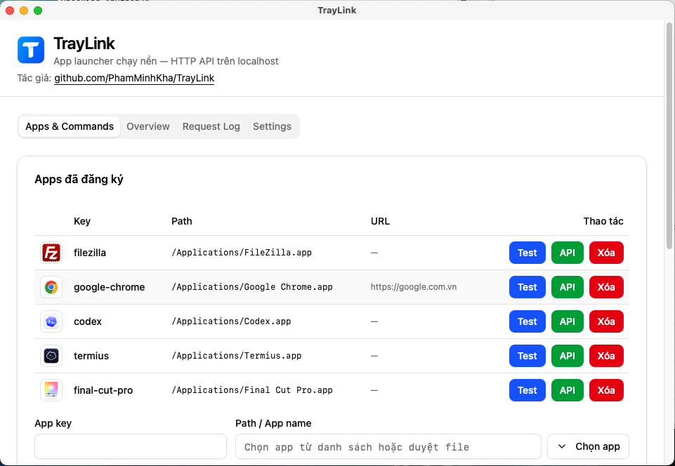
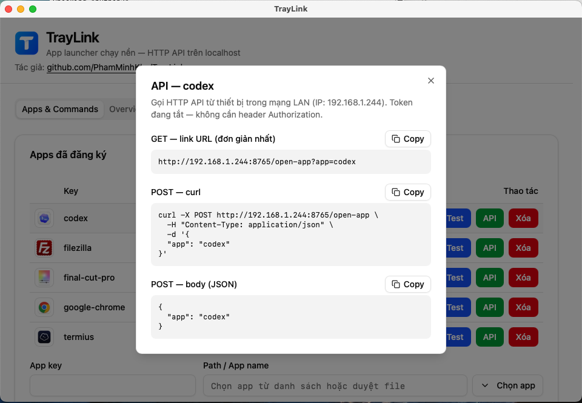

# TrayLink

App launcher chạy nền trên PC, lắng nghe HTTP API trên mạng LAN để mở ứng dụng, mở file, hoặc chạy lệnh đã whitelist.

**Stack:** Tauri 2 + Rust + React + shadcn/ui



## Tính năng

- HTTP REST API trên LAN (mặc định port `8765`, IP LAN tự phát hiện)
- **GET** bằng link URL hoặc **POST** bằng curl/JSON — bật/tắt GET trong Settings
- Token API **tùy chọn** (mặc định tắt, phù hợp dùng trong LAN)
- System tray (menu bar / system tray): Open Dashboard, Restart Server, Exit
- Chạy nền — đóng cửa sổ chỉ ẩn app, không thoát (macOS: không hiện Dock)
- Autostart khi boot
- Allowlist apps + command whitelist
- Dashboard: trạng thái server, request log, quản lý app, settings, copy link API

## Hướng dẫn sử dụng

### Video sử dụng đồng hồ AI để mở ứng dụng

<video src="docs/cach-su-dung.mov" controls width="720">
  <a href="docs/cach-su-dung.mov">Tải video hướng dẫn (docs/cach-su-dung.mov)</a>
</video>

*Cài app → thêm app → copy link API — dùng với Stream Deck / thiết bị trên LAN.*

**Sản phẩm trong video:** [Đồng hồ AI — loaai.me](https://loaai.me)

### Các bước nhanh

1. **Cài & mở TrayLink** — app chạy nền, icon nằm trên **menu bar** (macOS) hoặc **system tray** (Windows).
2. **Open Dashboard** từ menu tray → tab **Apps & Commands**.
3. **Thêm app** — nhập key (vd: `chrome`), chọn app từ danh sách hoặc duyệt file `.app` / `.exe`.
4. **Test** — thử mở app trên máy này.
5. **API** — mở modal, **Copy** link GET hoặc lệnh curl POST (dùng IP LAN, vd `http://192.168.1.x:8765/open-app?app=chrome`).
6. Dán link vào **Stream Deck**, shortcut, trình duyệt trên điện thoại/tablet cùng Wi‑Fi, hoặc gọi từ script.



### Ví dụ gọi API từ thiết bị khác (LAN)

```bash
# Kiểm tra server (GET)
curl http://192.168.1.x:8765/status

# Mở app bằng link (GET — cần bật "Cho phép GET" trong Settings)
open "http://192.168.1.x:8765/open-app?app=chrome"

# Hoặc POST
curl -X POST http://192.168.1.x:8765/open-app \
  -H "Content-Type: application/json" \
  -d '{"app":"chrome"}'
```

Thay `192.168.1.x` bằng **IP LAN** hiển thị trong Dashboard → **Overview** hoặc modal **API**.

## Tải bản cài đặt

Tải từ [GitHub Releases](https://github.com/PhamMinhKha/TrayLink/releases) hoặc build local (xem bên dưới).

| Nền tảng | File |
|----------|------|
| macOS (mọi Mac) | `TrayLink-macos-universal.zip` |
| macOS Apple Silicon | `TrayLink-macos-arm64.zip` |
| macOS Intel | `TrayLink-macos-x64.zip` |
| Windows | `TrayLink_*_x64-setup.exe` |

## Yêu cầu (dev / build)

- [Node.js](https://nodejs.org/) 18+
- [Rust](https://rustup.rs/) 1.88+
- macOS / Windows / Linux

## Cài đặt & chạy dev

```bash
npm install
npm run tauri dev
```

App khởi động ẩn — click icon tray → **Open Dashboard**.

## Build production

### Build local

```bash
npm run build:macos              # macOS (kiến trúc máy hiện tại)
npm run build:macos:universal    # macOS Intel + Apple Silicon
npm run build:windows            # Windows (chạy trên máy Windows)
```

Chi tiết: [`scripts/BUILD.md`](scripts/BUILD.md)

### Release qua GitHub Actions

#### Tải nhanh (mọi lần build)

Sau khi build xong, vào **Actions → Build Release → run mới nhất → Artifacts**:
- `traylink-macos-universal` — macOS Intel + Apple Silicon (một file)
- `traylink-macos-arm64` — macOS Apple Silicon (M1/M2/M3…)
- `traylink-macos-x64` — macOS Intel
- `traylink-windows`

#### Xuất hiện trên trang Releases

**Chỉ khi push tag `v*`** — workflow sẽ tạo [GitHub Release](https://github.com/PhamMinhKha/TrayLink/releases) và đính kèm file cài đặt:

```bash
git tag v0.1.0
git push origin v0.1.0
```

File trên Releases (ví dụ `v0.1.0`):
- `TrayLink-macos-universal.zip` — chạy cả Intel + Apple Silicon
- `TrayLink-macos-arm64.zip` — chỉ Apple Silicon
- `TrayLink-macos-x64.zip` — chỉ Intel
- `TrayLink_0.1.0_x64-setup.exe` — installer Windows (nếu build NSIS thành công)
- `.dmg` — nếu bundling DMG thành công trên CI

Đổi version: tăng tag (`v0.1.1`, `v0.2.0`, ...). Tag đã tồn tại thì xóa rồi push lại, hoặc dùng tag mới.

Hoặc vào **Actions → Build Release → Run workflow** để build thủ công (chỉ có Artifacts, **không** tạo Releases page).

Mỗi lần push lên `main` cũng tự chạy build (Artifacts only, không tạo Release).

### macOS: cảnh báo “Apple could not verify…”

Bản build từ GitHub / build local **chưa code-sign & notarize** nên macOS (Gatekeeper) chặn lần mở đầu. **Không phải virus** — chỉ là app chưa được Apple xác minh danh tính developer.

**Cách mở (chọn một):**

1. **Control + click** (hoặc chuột phải) vào `TrayLink.app` → **Open** → **Open** lần nữa  
2. **System Settings → Privacy & Security** → cuộn xuống → **Open Anyway** (sau khi thử mở app lần đầu)  
3. Terminal (bỏ cờ quarantine nếu tải từ browser/GitHub):

```bash
xattr -cr /Applications/TrayLink.app
```

Thay đường dẫn nếu app nằm chỗ khác (vd. `release/macos/TrayLink.app`).

**Phân phối chính thức (tùy chọn):** cần [Apple Developer Program](https://developer.apple.com/programs/) ($99/năm), ký app bằng Developer ID, rồi notarize qua `notarytool`.

## HTTP API

Base URL: `http://<IP-LAN>:8765` (IP hiển thị trong Dashboard)

### GET /status

```bash
curl http://192.168.1.x:8765/status
```

Response:

```json
{ "online": true, "version": "0.1.0", "port": 8765, "lan_ip": "192.168.1.x" }
```

### GET /open-app, /open-file, /exec (khi bật trong Settings)

```bash
# Mở app
http://192.168.1.x:8765/open-app?app=chrome

# Mở app + URL (trình duyệt)
http://192.168.1.x:8765/open-app?app=chrome&url=https://google.com

# Mở file
http://192.168.1.x:8765/open-file?path=/Users/you/video.mp4

# Chạy lệnh whitelist
http://192.168.1.x:8765/exec?cmd=restart_server
```

Nếu bật token: thêm `&token=<token>` vào URL.

### POST /open-app, /open-file, /exec

```bash
curl -X POST http://192.168.1.x:8765/open-app \
  -H "Content-Type: application/json" \
  -d '{"app":"chrome"}'
```

Khi bật token, thêm header `Authorization: Bearer <token>`.

## Xác thực

Mặc định **tắt** — phù hợp LAN tin cậy. Bật trong Dashboard → **Settings → Yêu cầu token API**.

- Header: `Authorization: Bearer <token>` hoặc `X-API-Token: <token>`
- GET: query `?token=<token>`

## Cấu hình

Config lưu tại app data directory:

- **macOS:** `~/Library/Application Support/com.phamminhkha.traylink/config.json`
- **Windows:** `%APPDATA%\com.phamminhkha.traylink\config.json`
- **Linux:** `~/.config/com.phamminhkha.traylink/config.json`

Defaults: [`config/defaults.json`](config/defaults.json)

| Tuỳ chọn | Mặc định | Mô tả |
|----------|----------|--------|
| `port` | `8765` | Port API |
| `require_token` | `false` | Bắt buộc token |
| `allow_get` | `true` | Cho phép gọi API bằng link GET |
| `autostart` | `false` | Tự chạy khi boot |

## Bảo mật

- Server bind `0.0.0.0` — thiết bị trong **cùng LAN** có thể gọi API
- Chỉ mở app/command/file có trong allowlist
- `open-file` chặn path traversal và system paths
- `exec` chỉ chấp nhận command key, không chạy raw shell
- Nên bật token nếu mạng LAN không tin cậy; cân nhắc firewall cho port API

## Cross-platform

| Platform | Mở app | Mở file |
|---|---|---|
| Windows | `spawn` / `start` | `cmd /C start` |
| macOS | `open -a` / `open` | `open` |
| Linux | `spawn` / `xdg-open` | `xdg-open` |

## Cấu trúc project

```
TrayLink/
├── config/defaults.json       # Config mặc định
├── docs/                      # Screenshot & video hướng dẫn
├── src/                       # React dashboard (shadcn/ui)
└── src-tauri/src/
    ├── api/                   # Axum HTTP server
    ├── launcher/              # open_app, open_file, exec
    ├── config/                # Store & persistence
    └── tray/                  # System tray
```

## License

MIT
